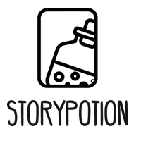

# 📚 Story Potion

<div align="center">



**당신의 이야기를 담는 마법의 포션** ✨

[](https://reactjs.org/)
[](https://firebase.google.com/)
[](LICENSE)

</div>

---

## 🌟 프로젝트 소개

Story Potion은 사용자가 개인적인 일기와 창작 소설을 작성하고 관리할 수 있는 웹 애플리케이션입니다. Firebase를 기반으로 한 안전한 데이터 저장과 사용자 인증 시스템을 제공하여, 언제 어디서나 자신만의 이야기를 기록할 수 있습니다.

## ✨ 주요 기능

### 📖 일기 작성 및 관리
- **개인 일기 작성**: 매일의 감정과 생각을 자유롭게 기록
- **일기 목록 조회**: 작성한 일기들을 시간순으로 정리하여 확인
- **일기 상세 보기**: 과거의 기록을 다시 읽어보며 추억 회상

### 📚 소설 창작 플랫폼
- **다양한 장르 지원**: 판타지, 로맨스, 미스터리, 역사물, 동화 등
- **소설 작성 도구**: 직관적인 인터페이스로 쉽고 편리한 글쓰기
- **장르별 분류**: 취향에 맞는 소설을 쉽게 찾아볼 수 있는 카테고리 시스템

### 🔐 사용자 인증 시스템
- **안전한 로그인/회원가입**: Firebase Authentication을 통한 보안
- **개인 정보 관리**: 마이페이지에서 사용자 정보 확인 및 수정
- **데이터 보호**: 개인별 데이터 분리로 프라이버시 보장

### ☁️ 클라우드 데이터 저장
- **Firebase Firestore**: 실시간 데이터베이스로 안정적인 저장
- **자동 동기화**: 여러 기기에서 작성한 내용이 자동으로 동기화
- **백업 및 복구**: 데이터 손실 걱정 없이 안전하게 보관

## 🚀 시작하기

### 필수 요구사항
- Node.js (v14.0.0 이상)
- npm 또는 yarn
- Firebase 프로젝트

### 설치 방법

1. **저장소 클론**
```bash
git clone https://github.com/20kyi/story-potion.git
cd story-potion
```

2. **의존성 설치**
```bash
npm install
```

3. **환경변수 설정**
프로젝트 루트에 `.env` 파일을 생성하고 Firebase 설정을 추가하세요:
```env
REACT_APP_FIREBASE_API_KEY=your_api_key
REACT_APP_FIREBASE_AUTH_DOMAIN=your_project.firebaseapp.com
REACT_APP_FIREBASE_PROJECT_ID=your_project_id
REACT_APP_FIREBASE_STORAGE_BUCKET=your_project.appspot.com
REACT_APP_FIREBASE_MESSAGING_SENDER_ID=your_sender_id
REACT_APP_FIREBASE_APP_ID=your_app_id
```

4. **개발 서버 실행**
```bash
npm start
```

5. **브라우저에서 확인**
```
http://localhost:3000
```

## 🛠️ 기술 스택

### Frontend
- **React 18**: 최신 React 기능을 활용한 사용자 인터페이스
- **CSS3**: 반응형 디자인과 모던한 UI/UX
- **Webpack**: 모듈 번들링 및 개발 환경 구성

### Backend & Database
- **Firebase Authentication**: 사용자 인증 및 보안
- **Firebase Firestore**: NoSQL 데이터베이스
- **Firebase Hosting**: 웹 애플리케이션 호스팅

### 개발 도구
- **npm**: 패키지 관리
- **Git**: 버전 관리
- **VS Code**: 개발 환경

## 📱 사용법

### 1. 회원가입/로그인
- 홈페이지에서 회원가입 또는 로그인
- 이메일과 비밀번호로 안전한 인증

### 2. 일기 작성
- "일기 작성" 메뉴에서 새로운 일기 작성
- 제목과 내용을 입력하여 저장
- 작성한 일기는 "일기 목록"에서 확인 가능

### 3. 소설 창작
- "소설" 메뉴에서 장르 선택
- 새로운 소설 작성 또는 기존 소설 수정
- 장르별로 분류되어 관리

### 4. 개인 정보 관리
- "마이페이지"에서 사용자 정보 확인
- 프로필 수정 및 계정 관리

## 🎨 프로젝트 구조

```
story-potion/
├── public/                 # 정적 파일
│   ├── icons/             # 아이콘 이미지
│   ├── novel_banner/      # 소설 배너 이미지
│   └── index.html         # 메인 HTML
├── src/                   # 소스 코드
│   ├── components/        # 재사용 가능한 컴포넌트
│   ├── pages/            # 페이지 컴포넌트
│   ├── firebase.js       # Firebase 설정
│   └── App.js            # 메인 앱 컴포넌트
├── functions/            # Firebase Functions
├── package.json          # 프로젝트 설정
└── README.md            # 프로젝트 문서
```

## 🤝 기여하기

1. 이 저장소를 Fork하세요
2. 새로운 기능 브랜치를 생성하세요 (`git checkout -b feature/AmazingFeature`)
3. 변경사항을 커밋하세요 (`git commit -m 'Add some AmazingFeature'`)
4. 브랜치에 푸시하세요 (`git push origin feature/AmazingFeature`)
5. Pull Request를 생성하세요

## 📄 라이선스

이 프로젝트는 MIT 라이선스 하에 배포됩니다. 자세한 내용은 [LICENSE](LICENSE) 파일을 참조하세요.

## 📞 문의

프로젝트에 대한 질문이나 제안사항이 있으시면 언제든 연락주세요!

- **이메일**: [0521kimyi@gmail.com]
- **GitHub**: [@20kyi](https://github.com/20kyi)

---

<div align="center">

**Story Potion으로 당신만의 특별한 이야기를 시작해보세요!** ✨

Made with ❤️ by Story Potion Team

</div> 
